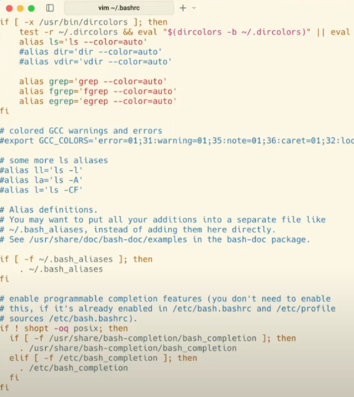

### 使用者home目錄
```bash
~
```
### 根目錄
```bash
/
```
### 去到指定目錄
```bash
cd
```
### 查詢現在路徑
```bash
pwd
```
### 檢查目錄內容
```bash
ls
```
### 檢查目錄內容（列表形式）
```bash
ls -l
```
### 檢查隱藏目錄內容（列表形式）
```bash
la -l -a
```
### 查詢ls功能
```bash
ls --help
```
### 查詢目錄所有內容
```bash
ls -al
```
### 回上一層目錄
```bash
cd ..
```
### linux 建立目錄
```bash
mkdir 目錄名稱
```
### 輸出
```bash
echo "content"
```
```bash
echo "content" > myfile.txt
```
### 看檔案內容
```bash
cat 檔案名稱.txt
```
### 建立全空的檔案
```bash
touch
```
### 環境變數
```bash
$HOME
```
### copy 
```bash
cp 來源檔 newfile.txt
```
```bash
cp -r 目錄 /tmp/
```
### move 移動檔案, 改變檔名
```bash
mv
```
### remove 
```bash
rm 
```
```bash
rm -rf ./目錄
```
### 套件管理程式
```bash
apt-get
```
```bash
sudo apt-get update 
```
```bash
sudo apt-get upgrade
```

### 查詢編輯器版本
```bash
nano --version
```
```bash
vi --version
```
```bash
vim --version
```
### 進入編輯器修改檔案
```bash
nano 檔案名稱
```
### 編輯模式
- Normal 模式
    - :w 存檔
    - :q 離開
    - :wq 存檔＋離開
- Insert 模式
    - i insert 
    - a append
    - o new line
    - esc or ctrl+[ 離開編輯模式

### 編輯 bashrc 文件
vim ~/.bashrc

# 更改環境變數
```bash
export VISUAL=
```
```bash
export EDITOR=
```
### 套用環境變數
```bash
source ~/.bashrc
```
### 離開vim
ctrl+c --> :qa --> enter
### 查詢現用環境變數
```bash
echo $VISUAL
```
### 進程管理系統
```bash
htop
```


### 絕對路徑 
/home/pi
### 相對路徑
### 其他
-- 完整名稱
- 縮寫(Capital)


