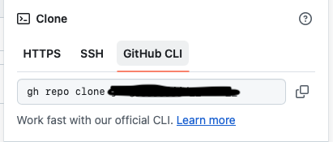

### clone repo 步驟
1. 創建repo
2. 進入repo 頁面

3. 複製https version url


4. clone repo
```bash
git clone github url
```

### 用編輯器編輯
1. 進入編輯器：nano, vim, vi
```bash
nano README.md
```
2. 儲存離開編輯器
```bash
:wq
```
3. push repo 

### github CLI
1. https://cli.github.com
2. 安裝github CLI
- To install:
```bash 
(type -p wget >/dev/null || (sudo apt update && sudo apt install wget -y)) \
	&& sudo mkdir -p -m 755 /etc/apt/keyrings \
	&& out=$(mktemp) && wget -nv -O$out https://cli.github.com/packages/githubcli-archive-keyring.gpg \
	&& cat $out | sudo tee /etc/apt/keyrings/githubcli-archive-keyring.gpg > /dev/null \
	&& sudo chmod go+r /etc/apt/keyrings/githubcli-archive-keyring.gpg \
	&& sudo mkdir -p -m 755 /etc/apt/sources.list.d \
	&& echo "deb [arch=$(dpkg --print-architecture) signed-by=/etc/apt/keyrings/githubcli-archive-keyring.gpg] https://cli.github.com/packages stable main" | sudo tee /etc/apt/sources.list.d/github-cli.list > /dev/null \
	&& sudo apt update \
	&& sudo apt install gh -y
```
- To upgrade:
```bash 
sudo apt update
sudo apt install gh
```
3. 驗證登入
```bash
gh auth login
```
- Github.com
- HTTPS
- Y
- Login with web browser 
- copy one-time code
- copy webside url to Chrome or Safari
4. 完成驗證畫面（可能會需要等待一陣子...）


5. Clone repo
```bash
gh repo clone 
```




